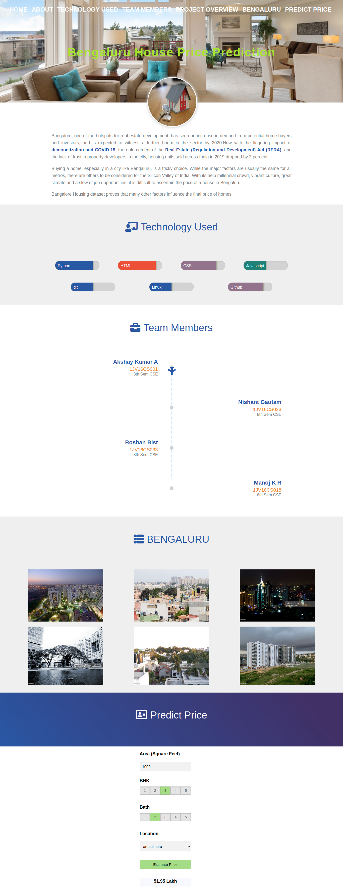

# VTU 8th sem Final Year Project
This is a Machine Learning Project, based on Bengaluru House Price Prediction using Regression Models.

## Installation

To run the project, perform the following tasks.

Goto the ***Server*** Folder then run: 

```bash
python server.py
```

Goto the ***Client*** Folder then open
```bash
app.html
```

## Have these things installed:
1) Anaconda   https://docs.anaconda.com/anaconda/install/
2) Python
3) flask
4) Vs code https://code.visualstudio.com/Download


## Contributing
Pull requests are welcome. For major changes, please open an issue first to discuss what you would like to change.

If you want the report of project email me: **menishantgautam@gmail.com**

Please make sure to update tests as appropriate.

## License
[MIT](https://choosealicense.com/licenses/mit/)

## Preview

